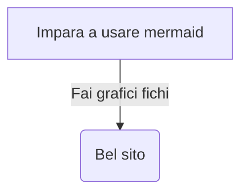

Lo scopo di questo documento è capire quali feature funzionano sia su Joplin che su wiki.js

# Feature che vanno ad entrambi

# H1

## H2

### H3

#### H4

##### H5

###### H6

Grassetto  
`**ciao**`  
**ciao**

Corsivo  
`*ciao*`  
_ciao_

Barrato  
 `~~ipsum~~`  
 ~~ipsum~~

Sottolineato  
`<ins>ciao</ins>`  
<ins>ciao</ins>

Sup e sub  
`ciao<sup>ciao</sup>ciao<sub>ddd</sub>`  
ciao<sup>ciao</sup>ciao<sub>ddd</sub>

O anche
X~1~ X^2^

Codice  
`normale`

```python
def main():
    print("ciao")
In python
```

Per fare andare mermaid su wiki.js bisogna aggiungere "kroki" come nell'esempio seguente



```kroki
mermaid

graph TD
    A[Impara a usare mermaid] -->|Fai grafici fichi| B(Bel sito)
```


C'è anche [bytefield](https://bytefield-svg.deepsymmetry.org/bytefield-svg/intro.html)

```bytefield
(def svg-attrs {:style "background-color:white"})
(def left-margin 1)
(def boxes-per-row 4)
(draw-column-headers)
(draw-box 0)
(doseq [val (range 31)]
  (draw-box val))
(draw-box "Address" {:span 4})
(draw-box "Size" {:span 2})
(draw-box 0 {:span 2})
(draw-gap "Payload")
(draw-bottom)
```

```kroki
bytefield

(def svg-attrs {:style "background-color:white"})
(def left-margin 1)
(def boxes-per-row 4)
(draw-column-headers)
(draw-box 0)
(doseq [val (range 31)]
  (draw-box val))
(draw-box "Address" {:span 4})
(draw-box "Size" {:span 2})
(draw-box 0 {:span 2})
(draw-gap "Payload")
(draw-bottom)
```

Caption  
`> ciao`

> ciao

Keyboard shortcuts

```
<kbd>CTRL</kbd> \+ <kbd>C</kbd>
```

<kbd>CTRL</kbd> \+ <kbd>C</kbd>

Note<sup>[\[1\]](#fn1)</sup> a pie.<sup>[\[2\]](#fn2)</sup>

Latex

```
$$
y <= x/2
$$
```

$\sqrt{3x-1}+(1+x)^2$

$$
y <= x/2
$$

$$
f(x) = \int_{-\infty}^\infty
	\hat f(\xi)\,e^{2 \pi i \xi x}
	\,d\xi
$$

Lista

- Milk
- Eggs

Lista

- 1
- 2
- 3

Ordered list

1. A
2. B
   1. C
   2. D

- [ ] Milk
- [x] Rice
  - [ ] Eggs
  - [ ] Milk
    - [x] Rice
- [ ] Eggs

:smile:


One rule:

---

kk

# Feature che vanno solo su Joplin

TOC
${toc}

Evidenziato  
`==ciao==`  
==ciao==

Addirittura le reazioni chimiche?

$\ce {CO2 + C -> 2 CO}$

(c)

```fountain
Your screenplay...
```

Term 1

: Definition 1

Term 2 with _inline markup_

: Definition 2

        { some code, part of Definition 2 }

    Third paragraph of definition 2.

Each term must fit on one line, which m

++inserted++

Tabella strana

| | Grouping ||
First Header | Second Header | Third Header |
------------ | :-----------: | -----------: |
Content | _Long Cell_ ||
Content | **Cell** | Cell |

New section | More | Data |
And more | With an escaped '\\|' ||
[Prototype table]

# Feature che vanno solo su wiki.js

> lol {.is-success}

## Another rule:

Lista

- 1
- 2
- 3
  {.grid-list}

Lista di link

- 1
- 2
- [Morbi vehicula aliquam _Third subtitle description here_](https://www.google.com)
  {.links-list}

# Tabs {.tabset}

## First Tab

Any content here will go into the first tab...

## Second Tab

Any content here will go into the second tab...

# Basta


1.  A string of syntactic words. [↩︎](#fnref1)
2.  A useful example sentence. [↩︎](#fnref2)
